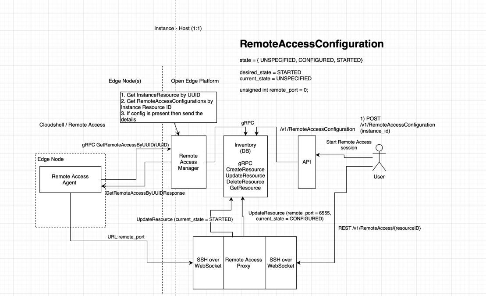

# Design Proposal: Reverse Proxy to Edge Nodes

Author(s): [Frątczak Wiktor]

Last updated: [03.07.2025]

## Abstract

The Intel Open Edge platform orchestrates workloads on distributed edge devices.
In practice, these devices are often deployed in hard-to-reach locations such as factories,
telecom sites, retail outlets, or offshore wind farms, where physical access is limited and costly.
Moreover, edge nodes are typically placed behind firewalls and private networks,
complicating secure connectivity.

To address these challenges, enterprise operators require a standardized way to establish secure,
on-demand SSH sessions for diagnostics and maintenance.
This document proposes extending Intel Open Edge with native SSH session management,
providing scalable and controlled remote access across diverse deployment scenarios.

## Proposal Summary

This proposal extends Intel Open Edge with a remote access workflow for SSH connectivity.
Each edge node runs a lightweight Remote Access Agent that periodically polls the orchestrator
and, once authorized, establishes a persistent connection to the Remote Access Proxy.
On the orchestrator side, a Remote Access Manager coordinates the session lifecycle,
while the Remote Access Proxy acts as a gateway that bridges SSH connections and
exposes a WebSocket interface for the UI. The Inventory service is extended to track device
availability and session configurations.

## Requirements

To support secure and scalable remote access to edge nodes, the solution must:

* Allow users to initiate secure on-demand SSH sessions without direct exposure of edge devices.
* Provide a lightweight agent on each node, capable of establishing and maintaining an on-demand connection with the
  orchestrator’s Remote Access Proxy.
* Enable the orchestrator to control the full session lifecycle (creation, updates, timeout, teardown).
* Enhance the Inventory service to map session requests to registered devices and track its states.
* Expose a new synchronous HTTP orchestrator endpoint for uprościć na „initiating and terminating sessions.
* Enforce validation and access control to guarantee secure operations across diverse deployment environments.

## Proposed changes

The following modifications are introduced to Intel Open Edge:

* Remote Access Agent – lightweight service on each edge node that polls the Remote Access Manager
  for authorized session requests and, when instructed, establishes an on-demand persistent connection
  to the Remote Access Proxy for the duration of the session.
* Remote Access Manager – control-plane component that processes user/API requests, creates and updates session
  configurations in the Inventory service, and responds to agent polls with directives to establish or terminate
  connections based on stored session data.
* Remote Access Proxy – a scalable orchestrator-side gateway that terminates agent connections, exposes
  temporary SSH endpoints for clients and provides a WebSocket interface for browser-based access.
* Inventory Integration – the orchestrator’s Inventory Database is extended with new model for session
  configuration, device registration and state tracking.
* New API Endpoint – an orchestrator API that allows operators to initiate, monitor, and terminate
  sessions via UI or terminal tools that uses websocket.

[//]: # (TODO: TBA When remote access config will be created how should Remote Access Manager know about this, should it ask inventory periodically - imo worse, or should the inventory itself notify manager about it)

## High Overview Diagram

## Required Flow

1. User requests SSH session (API/UI) to specific edge Node.
2. API perform request to Remote Access Manager to create a remote access config instance.
3. Manager creates a session config and stores it in Inventory.
4. Remote Access Agent polls Manager for new configs, if its present Manager responds with one.
5. The Agent establishes an on-demand persistent tunnel to the Remote Access Proxy using the received configuration.
6. The Remote Access Proxy registers the tunnel and updates the session state to STARTED in the Inventory.

[//]: # (   Should RAP do it by itself or via Remote Access Manager )

7. Remote Access Proxy initialize reverse SSH connection to the Edge Node and exposes a temporary endpoint for the user.
8. User gets an endpoint to connect to the desired SSH connection.
9. The user connects to the Proxy endpoint, which forwards traffic through the tunnel to the edge node’s SSH server.

## Database Model

RemoteAccessConfiguration

* Each configuration has a unique resource_id in the format rmtacconf-xxxxxxxx.
* Linked to a specific compute.v1.InstanceResource (edge node).
* desired_state is set by the administrator, while current_state is maintained by the Resource Manager (ENABLED,
  DELETED, ERROR).
* expiration_timestamp defines the validity period of the remote access session.
* The Resource Manager may set a temporary local_port (on the orchestrator side) and user (remote login user on the edge
  node).
* Operational status is tracked via configuration_status, configuration_status_indicator, and
  configuration_status_timestamp (updated atomically).
* Each record is bound to a tenant_id and includes created_at and updated_at timestamps.
* The RemoteAccessState enum is used consistently for both desired_state and current_state.

## Minimal Database changes

    RemoteAccessConfiguration {
      +string resource_id
      +InstanceResource instance
      +uint64 expiration_timestamp
      +uint32 local_port (optional)
      +string token (optional)
      +RemoteAccessState current_state (optional)
      +RemoteAccessState desired_state
      +string configuration_status (optional)
      +StatusIndication configuration_status_indicator (optional)
      +uint64 configuration_status_timestamp (optional)
      +string tenant_id
      +TIMESTAMP created_at
      +TIMESTAMP updated_at
    }

    RemoteAccessState {
      <<enum>>
      REMOTE_ACCESS_STATE_UNSPECIFIED = 0
      REMOTE_ACCESS_STATE_DELETED     = 1
      REMOTE_ACCESS_STATE_ERROR       = 2
      REMOTE_ACCESS_STATE_CONFIGURED  = 3
      REMOTE_ACCESS_STATE_STARTED     = 4
    }

## Security considerations

In remote access systems like Intel Open Edge, the critical design question is how to
authenticate and authorize both users and devices before establishing a session. 

First we need to differentiate 3 types of communication that requires Auth mechanisms:

1. Internal communication inside Orchestrator
2. Agent <--> Remote Access Manager
3. Agent <--> Remote Access Proxy
4. User <--> Remote Access Proxy

### Ephemeral certificates vs SSH keys

## Scalability considerations

### Multiplexing one ports for few sessions at once

## Rationale

[A discussion of alternate approaches that have been considered and the trade
offs, advantages, and disadvantages of the chosen approach.]

## Affected components and Teams

## Implementation plan

[A description of the implementation plan, who will do them, and when.
This should include a discussion of how the work fits into the product's
quarterly release cycle.]

## Open issues (if applicable)

[A discussion of issues relating to this proposal for which the author does not
know the solution. This section may be omitted if there are none.]
