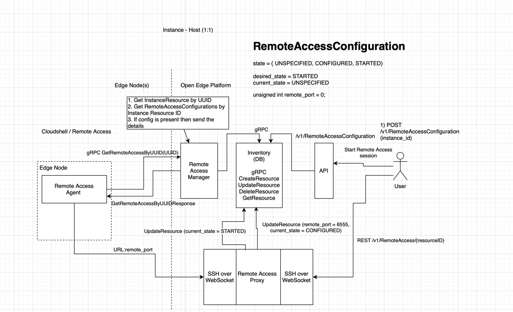
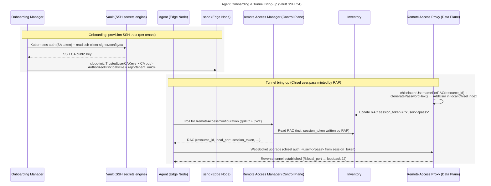
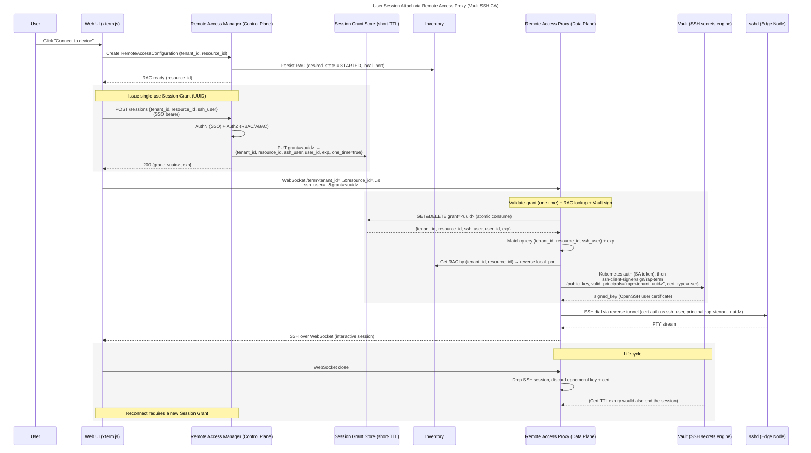

# Design Proposal: Reverse Proxy to Edge Nodes

Author(s): [Frątczak Wiktor]

Last updated: [03.07.2025]

## Abstract

The Intel Open Edge platform orchestrates workloads on distributed edge devices.
In practice, these devices are often deployed in hard-to-reach locations such as factories,
telecom sites, retail outlets, or offshore wind farms, where physical access is limited and costly.
Moreover, edge nodes are typically placed behind firewalls and private networks,
complicating secure connectivity.

To address these challenges, enterprise operators require a standardized way to establish secure,
on-demand SSH sessions for diagnostics and maintenance.
This document proposes extending Intel Open Edge with native SSH session management,
providing scalable and controlled remote access across diverse deployment scenarios.

## Proposal Summary

This proposal extends Intel Open Edge with a remote access workflow for SSH connectivity.
Each edge node runs a lightweight Remote Access Agent that periodically polls the orchestrator
and, once authorized, establishes a persistent connection to the Remote Access Proxy.
On the orchestrator side, a Remote Access Manager coordinates the session lifecycle,
while the Remote Access Proxy acts as a gateway that bridges SSH connections and
exposes a WebSocket interface for the UI. The Inventory service is extended to track device
availability and session configurations.

## Requirements

To support secure and scalable remote access to edge nodes, the solution must:

* Allow users to initiate secure on-demand SSH sessions without direct exposure of edge devices.
* Provide a lightweight agent on each node, capable of establishing and maintaining an on-demand connection with the
  orchestrator’s Remote Access Proxy. The agent is a new component installed during node onboarding as a
  systemd-managed service; no extra installation step is required at session time.
* Provision tenant-scoped SSH trust on the edge node **at onboarding time**, before any remote-access
  session is ever requested: the Vault SSH CA public key must be installed as `TrustedUserCAKeys` in
  `sshd`, and `AuthorizedPrincipalsFile` must accept the tenant principal `rap:<tenant_uuid>`. This
  removes the need for long-lived SSH key distribution to nodes.
* Introduce a dedicated Vault **SSH secrets engine** mount that acts as the single CA trusted by
  edge-node `sshd`, with a signing role that scopes principals to `rap:<tenant_uuid>` and enforces
  short certificate TTLs.
* Enable the orchestrator to control the full session lifecycle (creation, updates, timeout, teardown).
* Enhance the Inventory service to map session requests to registered devices and track its states.
* Expose a new orchestrator API for initiating and terminating interactive sessions, reachable from the
  UI (browser WebSocket) and from operator tooling.
* Enforce validation and access control to guarantee secure operations across diverse deployment environments.

## Proposed changes

The following modifications are introduced to Intel Open Edge:

* Remote Access Agent – **new** lightweight service installed on every edge node at onboarding time
  as a systemd unit. It polls the Remote Access Manager for authorized session requests and, when
  instructed, establishes an on-demand persistent connection to the Remote Access Proxy for the
  duration of the session. The agent holds no SSH key material for the proxy direction; all
  SSH authentication is done through Vault-issued ephemeral certificates terminated on the Proxy.
* Remote Access Manager – control-plane component that processes user/API requests, creates and updates session
  configurations in the Inventory service, and responds to agent polls with directives to establish or terminate
  connections based on stored session data.
* Remote Access Proxy – a scalable orchestrator-side gateway that terminates agent connections, exposes
  temporary SSH endpoints for clients and provides a WebSocket interface for browser-based access.
  At session attach time the Proxy authenticates to Vault (Kubernetes auth) and mints an OpenSSH user
  certificate that is consumed entirely in-process — no SSH private key is written to disk.
* Onboarding Manager – **extended** to establish SSH trust on the edge node before any RAC exists.
  It reads the SSH CA public key from the Vault SSH secrets engine
  (`<mount>/config/ca`, default mount `ssh-client-signer`) and emits cloud-init that (a) installs the
  Remote Access Agent binary and systemd unit, (b) writes the CA public key to
  `/etc/ssh/trusted-user-ca-keys.pem` and sets `TrustedUserCAKeys` in `sshd_config`, and
  (c) configures `AuthorizedPrincipalsFile` to accept the tenant principal `rap:<tenant_uuid>`.
  The CA public key is fetched from Vault **on every cloud-init render**, with no in-process
  caching: each onboarded node triggers a fresh Kubernetes-auth login + `config/ca` read (≈20-50 ms).
  Always-fresh reads keep CA rotation operationally trivial — a rotated key propagates to the next
  node onboarded without any OM pod restart. Because trust is established **per tenant**, onboarding
  happens once per node — subsequent RACs do not require touching the node again. For this new
  access path OM authenticates to Vault using a **dedicated, narrow Kubernetes-auth role**
  `onboarding-manager` provisioned by the `infra-charts/vault-ssh-secrets-engine` chart; the role is
  backed by a policy scoped only to `read` on `<mount>/config/ca`. OM runs as the Kubernetes
  ServiceAccount `orch-svc` (shared with other orchestrator services that use it for broader Vault
  secret access via role `orch-svc`), and the new `onboarding-manager` role binds that same SA to a
  separate, narrow policy — so the SSH CA read permission lives outside the shared `orch-svc`
  policy, on its own Vault-side boundary (see *Vault SSH CA integration* for details).
* Vault SSH secrets engine – **new** Vault mount (default path `ssh-client-signer`) acting as the
  single CA trusted by edge-node `sshd`. It exposes a signing role (default `rap-term`) that permits
  the Proxy to sign short-lived user certificates with `valid_principals=rap:<tenant_uuid>` and
  `cert_type=user`. The Vault CA public key is the only SSH trust material pushed to the node.
* Inventory Integration – the orchestrator’s Inventory Database is extended with a new model for session
  configuration, device registration, and state tracking (see *Minimal Database changes*).
* New API Endpoint – an orchestrator API that allows operators to initiate, monitor, and terminate
  sessions via UI or terminal tools. Interactive traffic is carried over a WebSocket (`/term`) gated
  by a single-use Session Grant minted by the Remote Access Manager.

The architectural separation between the Remote Access Manager and the Remote Access Proxy is a deliberate design
choice that enables flexible, independent scaling of the control plane and data plane according to system load.

[//]: # (TODO: TBA When remote access config will be created how should Remote Access Manager know about this, should it ask inventory periodically - imo worse, or should the inventory itself notify manager about it)

## High Overview Diagram

## Required Flow

The flow is split into three phases: **edge-node onboarding** (once per node, establishes SSH trust
and installs the agent), **tunnel bring-up** (persistent, per RAC), and **interactive session
attach** (per `/term` request, ephemeral). See the sequence diagrams in the next section for full
detail.

**0. Edge-node onboarding (once per node, before any RAC exists)**

1. The Onboarding Manager authenticates to Vault via Kubernetes auth using its existing
   ServiceAccount `orch-svc` against the dedicated role `onboarding-manager`, and reads the SSH CA
   public key from the Vault SSH secrets engine (`<mount>/config/ca`, default mount
   `ssh-client-signer`).
2. The Onboarding Manager emits cloud-init that, on first boot of the edge node:
    * installs the **Remote Access Agent** binary and its systemd service unit,
    * writes the Vault SSH CA public key to `/etc/ssh/trusted-user-ca-keys.pem` and sets
      `TrustedUserCAKeys` in `sshd_config`,
    * configures `AuthorizedPrincipalsFile` for the node’s service user to accept the tenant
      principal `rap:<tenant_uuid>`, and restarts `sshd`.
3. Once the node is up, the Agent starts polling the Remote Access Manager over gRPC + JWT. SSH
   trust is already in place, so any subsequently created RAC can transition to phase A without
   further node-side changes.

**A. Tunnel bring-up (Agent ↔ Remote Access Proxy)**

1. An operator (UI/API) requests remote access enablement for a specific edge node.
2. The Remote Access Manager creates a `RemoteAccessConfiguration` (RAC) in the Inventory with
   `desired_state = STARTED`.
3. The Remote Access Proxy reconciles the new RAC, mints the per-RAC Chisel `session_token`
   (`<user>:<password>`) into its in-process Chisel user index, and writes it back into the RAC.
4. The Remote Access Agent polls the Manager and receives the RAC (including the
   `session_token` that the Proxy just wrote into Inventory).
5. The Agent opens the WebSocket reverse tunnel (`R:local_port → loopback:22`) to the
   Remote Access Proxy, authenticating with the `session_token`.
6. The Remote Access Proxy registers the tunnel and updates the session state to `STARTED` in
   the Inventory.

[//]: # (   Should RAP do it by itself or via Remote Access Manager )

**B. Interactive session attach (User ↔ Remote Access Proxy)**

7. The user authenticates to the orchestrator via JWT and the UI requests an interactive
   session against `(tenant_id, resource_id)` from the Remote Access Manager.
8. The Manager runs RBAC/ABAC and, on success, mints a single-use **Session Grant** (UUID)
   bound to `(tenant_id, resource_id, ssh_user, user_id, exp, one_time=true)` in the Session
   Grant Store, and returns the UUID to the UI.
9. The UI opens
   `wss://…/term?tenant_id=…&resource_id=…&ssh_user=…&grant=<uuid>`. The Remote Access Proxy
   atomically consumes the grant, looks up the matching RAC for the reverse-tunnel port, and
   opens an SSH session over the existing reverse tunnel using a freshly minted Vault-signed
   user certificate. The terminal stream is exposed to the browser only as the WebSocket.

## Minimal Database changes

    RemoteAccessConfiguration {
      +string resource_id
      +InstanceResource instance
      +uint64 expiration_timestamp
      +uint32 local_port (optional)
      +string session_token (optional)            // <user>:<password> minted by RAP for Chisel auth
      +RemoteAccessState current_state (optional)
      +RemoteAccessState desired_state
      +string configuration_status (optional)
      +StatusIndication configuration_status_indicator (optional)
      +uint64 configuration_status_timestamp (optional)
      +string tenant_id
      +TIMESTAMP created_at
      +TIMESTAMP updated_at
    }

    RemoteAccessState {
      <<enum>>
      REMOTE_ACCESS_STATE_UNSPECIFIED = 0
      REMOTE_ACCESS_STATE_DELETED     = 1
      REMOTE_ACCESS_STATE_ERROR       = 2
      REMOTE_ACCESS_STATE_CONFIGURED  = 3
      REMOTE_ACCESS_STATE_STARTED     = 4
    }

## Security considerations

In remote access systems like Intel Open Edge, the critical design question is how to
authenticate and authorize both users and devices before establishing a session.

We differentiate four types of communication that require Auth mechanisms:

1. Agent ↔ Remote Access Manager

   The Agent communicates with the Remote Access Manager using **gRPC + JWT + HTTPS**.  
   The access token is generated by the orchestrator, consistent with the current implementation.  
     

2. Agent ↔ Remote Access Proxy

   The Agent and the Remote Access Proxy speak **SSH over WebSocket** carried by an embedded Chisel
   library. The WebSocket transport is authenticated with a **per-RAC bearer credential**
   (`<user>:<password>`) that is **generated by the Remote Access Proxy** during reconciliation of a
   `RemoteAccessConfiguration`: the Proxy derives a stable username from the RAC `resource_id`,
   draws a fresh random password, registers the pair in its in-process Chisel user index, and
   writes it back to the RAC as `session_token` in Inventory. The Manager only **reads** that
   field from Inventory and hands it to the Agent in the next gRPC poll response — it is the
   Proxy, not the Manager, that decides which credential the agent must present. The credential
   is scoped to a single RAC (and therefore a single edge-node tunnel), is rotated on rebind,
   and expires together with the configuration, so a leaked token is useless outside the active
   tunnel’s lifetime. No long-lived agent secret is provisioned for this channel.

   Inside that tunnel, SSH itself is authenticated with **Vault-issued ephemeral user
   certificates**. The edge node’s `sshd` is provisioned at onboarding time to trust the
   Vault SSH CA (`TrustedUserCAKeys`) and to accept a tenant-scoped principal
   (`AuthorizedPrincipalsFile` = `rap:<tenant_uuid>`). The agent itself does not hold any SSH
   key material for the proxy direction; the certificate is generated and consumed entirely on
   the Remote Access Proxy.
     

3. User ↔ Remote Access Proxy

   Authorization on the `/term` WebSocket is enforced through a **single-use Session Grant
   (UUID)** issued by the Remote Access Manager. The flow is:

    1. The user authenticates to the orchestrator via SSO (Keycloak) and the UI calls the
       Manager API for an interactive session against `(tenant_id, resource_id)`.
    2. The Manager checks the user’s RBAC/ABAC entitlements for that tenant and edge node and,
       only on success, mints a **Session Grant** — a random UUID bound server-side to
       `(tenant_id, resource_id, ssh_user, user_id, exp, one_time=true)` and stored in a
       short-TTL session store shared with the Proxy (or queryable by the Proxy via a
       backchannel introspection RPC). The UUID itself carries no claims; it is an opaque
       reference whose authority lives entirely in that store.
    3. The UI opens
       `wss://…/term?tenant_id=<uuid>&resource_id=<uuid>&ssh_user=<name>&grant=<uuid>`.
    4. The Remote Access Proxy resolves the grant, **atomically consumes** the `one_time` flag,
       and verifies that the grant’s bound `(tenant_id, resource_id, ssh_user)` match the
       query and that it has not expired. Only then does it look up the matching
       `RemoteAccessConfiguration` in Inventory to resolve the reverse-tunnel port and open the
       SSH session to the edge node using a freshly minted **Vault-signed user certificate**
       (see *Vault SSH CA integration* below).

   The user never receives a private key, certificate, or any long-lived token; the Session
   Grant is consumed by the very first `/term` upgrade and the only thing exposed to the
   browser is the WebSocket terminal stream. Reconnects require a new grant.
     

4. User ↔ Remote Access Manager

   This is the channel on which all interactive-session **authorization decisions** happen.
   The user authenticates to the orchestrator via **SSO (Keycloak)**; the UI calls the
   Manager API over **HTTPS** with the SSO bearer token. The Manager evaluates **RBAC/ABAC**
   for `(tenant_id, resource_id, ssh_user)` and only on success issues the **Session Grant
   (UUID)** that the UI will present to the Proxy on `/term` (see point 3). RAC lifecycle
   operations (create/update/delete) and listing of edge nodes are exposed on the same
   channel and gated by the same SSO + RBAC layer; no path bypasses the Manager to reach the
   Proxy directly.
     

### Reverse SSH as a Secure Mechanism for Enabling Access Between Edge Devices via Orchestrator

In distributed edge environments, devices are often deployed behind NATs or firewalls, which makes direct inbound
connections from external networks impractical or even impossible. **Reverse SSH** provides a robust and secure
mechanism to establish such connectivity.  
In this approach, the **edge device initiates an outbound SSH connection** to a central component within the
orchestrator’s domain — the **Remote Access Proxy**. Since most networks allow outbound connections, this method
bypasses NAT traversal and eliminates the need for port forwarding or VPN tunnels.

Once the reverse SSH tunnel is established, the orchestrator can securely route client connections through the
Remote Access Proxy to the target edge device. This enables administrators or automated services to execute remote
commands, transfer files, or interact with device terminals without exposing the device’s SSH port directly to the
internet.

The reverse SSH mechanism also simplifies **session lifecycle management**: tunnels can be opened and closed on demand,
logged, and automatically cleaned up after a timeout or orchestration event. This approach aligns well with the *
*ephemeral, dynamic nature** of edge environments, where devices may frequently join or leave the network.

---

### Chisel as a WebSocket Transport Layer for Reverse SSH

While traditional reverse SSH relies on TCP, modern edge environments often benefit from using
**WebSocket-based tunnels**, which can seamlessly traverse corporate proxies and restrictive firewalls.  
**Chisel** is an open-source, lightweight tunneling tool that supports exactly this functionality. In this project,
Chisel is not used as a standalone CLI tool but is **integrated as a Go library** within the `remote-access-proxy` and
`edge node agent`components, forming the **data plane** for all SSH reverse tunnels.

Chisel encapsulates SSH traffic inside a **WebSocket stream**, allowing the Remote Access Proxy to handle both SSH
and web-based client connections in a unified manner. This design enables advanced capabilities such as:

- **Bidirectional multiplexing** of multiple SSH sessions over a single WebSocket connection,
- **Secure session termination** and monitoring from the orchestrator layer,
- Integration with web interfaces (e.g., **xterm.js**) for browser-based SSH access,
- Efficient use of existing infrastructure — since WebSockets typically reuse port 443, no additional firewall rules are
  needed.

Using Chisel as a WebSocket transport layer provides a modern, cloud-native foundation for remote edge access — one that
remains compatible with HTTP-based load balancers, ingress controllers, and service meshes.

---

### Ephemeral Certificates vs SSH Keys

Traditional SSH authentication relies on **static key pairs** — long-lived public/private keys that must be distributed
and managed across devices. While simple to implement, static keys pose several operational and security challenges:

- Difficult key rotation and revocation,
- Risk of unauthorized reuse or leakage,
- Lack of auditability and time-bound access control.

To address these limitations, the platform uses **ephemeral SSH certificates** issued by **HashiCorp Vault**’s
**SSH secrets engine** acting as the trusted **Certificate Authority** for the orchestrator. Each time a `/term`
session is opened, the **Remote Access Proxy** generates a fresh in-memory key pair and asks Vault to sign a
**short-lived** OpenSSH **user certificate** (TTL 5 minutes, ceiling 15 minutes) bound to the tenant
principal. The certificate is used exactly once for the SSH handshake of that interactive session and is
discarded together with the in-memory key pair and the WebSocket. Because active SSH sessions are not
re-authenticated after the transport is established, the short TTL only needs to cover dial + handshake and
not the whole interactive session.

This approach provides several advantages:

- **Strong security guarantees** — certificates automatically expire, reducing the attack surface,
- **Centralized access control** — Vault policies define which orchestrator components may sign certificates and
  with which `valid_principals`, scopes, and TTLs,
- **Better traceability** — every access request is tied to a unique certificate identity (Vault serial + key id),
  simplifying auditing and compliance,
- **Seamless integration** with reverse SSH — ephemeral credentials are issued at session attach time, so no
  persistent SSH secret is stored on the edge node or pushed over the wire,
- **Tenant-scoped principal** — each cert carries a `valid_principals = rap:<tenant_uuid>` value that the edge
  node’s `sshd` matches against `AuthorizedPrincipalsFile`, providing cryptographic tenant isolation. Session-
  level context (user identity, role, RAC binding) is not encoded in the certificate; it lives in the Session
  Grant issued by the Remote Access Manager (see *Multitenancy and Context-Aware Access Control*).

#### Vault SSH CA integration

The platform uses Vault’s **SSH secrets engine** as the single source of trust for interactive SSH access to edge
nodes. The integration touches three components:

- **Onboarding Manager** — at edge-node provisioning time, reads the SSH CA public key from Vault
  (`<mount>/config/ca`, mount `ssh-client-signer`) using **Kubernetes auth**, and emits cloud-init that installs
  the key as `TrustedUserCAKeys` on the node’s `sshd` and configures `AuthorizedPrincipalsFile` to accept the
  tenant principal `rap:<tenant_uuid>`. Trust is established **per tenant**, before any
  `RemoteAccessConfiguration` exists, so reattaching new sessions does not require touching the node again.

  For this path OM authenticates with a **dedicated Vault K8s-auth role** `onboarding-manager`, provisioned by
  the `infra-charts/vault-ssh-secrets-engine` chart alongside the RAP role `remote-access-proxy`. The role is
  backed by a narrow Vault policy `onboarding-manager` that grants **only `read` on `<mount>/config/ca`** — no
  other Vault paths, no write/update capabilities.

  The role is bound to the Kubernetes ServiceAccount `orch-svc` in the `orch-infra` namespace, i.e. the same SA
  the OM pod runs as for its broader Vault secret access (role `orch-svc`, policy `orch-svc`, `secret/*` CRUD).
  Reusing the existing SA keeps OM to a single Kubernetes identity — avoiding a second ServiceAccount and
  extra RBAC bindings — while the SSH CA capability is still isolated at the **Vault-side policy boundary**:
  the SSH CA read lives in policy `onboarding-manager`, not in the shared `orch-svc` policy that is owned by
  an upstream platform Job and carries a broader `secret/*`-only capability set. Vault K8s auth allows one SA
  to authenticate against multiple roles explicitly by name; OM picks `onboarding-manager` for the SSH CA read
  by configuration (`RAP_VAULT_K8S_AUTH_ROLE=onboarding-manager` env / Helm value) while the unrelated secret
  access keeps using `orch-svc`. Placing the policy + role in the same chart that owns the `ssh-client-signer`
  mount keeps all three objects (engine, sign role, CA-read role) under a single lifecycle owner: uninstalling
  the chart removes them atomically.

  Every cloud-init render performs a fresh Vault Kubernetes-auth login (with role `onboarding-manager`) and a
  `config/ca` read — OM does **not** cache the CA public key across calls. The helper is invoked at most once
  per onboarded node, the cost on a healthy cluster is ≈20-50 ms, and rotating the Vault SSH CA therefore
  propagates to the next onboarded node without any OM pod restart. A short-TTL cache could be reintroduced
  later if burst onboarding measurements show Vault pressure, but at the current traffic profile the
  simplicity of always-fresh reads outweighs any saving.
- **Remote Access Proxy** — for every `/term` request authenticates to Vault via Kubernetes auth (role
  `remote-access-proxy`), generates an ephemeral ed25519 key pair in memory, and calls
  `<mount>/sign/<role>` (default role `rap-term`) with `valid_principals=rap:<tenant_uuid>`,
  `cert_type=user`, and an explicit `ttl=5m` to obtain a one-shot OpenSSH user certificate. The signed key
  is wrapped in an `ssh.AuthMethod` and presented to the edge node’s `sshd` over the reverse tunnel. The
  private key never leaves the Proxy process and is dropped together with the certificate when the
  WebSocket closes.
- **Vault** — provides the `auth/kubernetes` method and the `ssh-client-signer` SSH secrets engine with a signing
  role whose policy permits the Proxy to sign certificates with the `rap:<tenant_uuid>` principal pattern.
  The signing role is configured with `ttl=5m` / `max_ttl=15m`, capping how long any issued certificate may
  live even if a client were to request a longer lifetime. The **Vault SSH CA key itself has no expiry** —
  it is generated once at engine bootstrap (`generate_signing_key=true`), persists in Vault storage, and is
  only rotated by an explicit platform operation (`vault delete <mount>/config/ca` followed by regeneration
  and re-rollout of any cached public key — see the Onboarding Manager bullet above for why OM does not
  cache it).

Principals follow the format **`rap:<tenant_uuid>`**. The RAC `resource_id` is intentionally **not** part of the
principal: the edge node can be made trust-ready during onboarding (when the tenant is known but a RAC may not
yet exist), while the `resource_id` from the `/term` request is still used by the Proxy to look up the active RAC
in Inventory and resolve the correct reverse-tunnel port.

### Multitenancy and Context-Aware Access Control

In multi-tenant edge environments, where multiple organizations share the same orchestration platform, **tenant
isolation and contextual access control** are critical. The design splits these responsibilities across three
layers — none of them tries to encode everything in the SSH certificate alone:

- **SSH certificate (Vault SSH CA)** — carries a **single, tenant-scoped principal**
  `rap:<tenant_uuid>`, plus standard cert fields (TTL, `cert_type=user`, key id / serial issued by Vault for
  audit). The cert deliberately does **not** carry `user_id`, role, RAC `resource_id`, or session policy: it is
  consumed by `sshd` on the edge node, which only knows about `TrustedUserCAKeys` and
  `AuthorizedPrincipalsFile`, and would silently ignore richer claims anyway. Tenant separation is enforced
  here because a Vault-signed cert with principal `rap:<tenant-A>` will never satisfy
  `AuthorizedPrincipalsFile` on a node provisioned for `tenant-B`.
- **Session Grant (RAM)** — RAM is the component that runs **RBAC/ABAC**, knows the calling user identity from
  SSO, and binds a session to **`(tenant_id, resource_id, ssh_user, user_id, exp, one_time=true)`** before the
  Proxy ever opens `/term`. Roles, scopes, policy references and per-session limits live here, in the grant
  record stored in the short-TTL session store, not on the certificate.
- **Tunnel credential (RAP)** — the per-RAC Chisel `session_token` minted by the Proxy is itself
  tenant/RAC-scoped (it can authenticate **only** the agent for that specific RAC), giving an additional
  data-plane separation independent of any user-facing claims.

The orchestrator acts as a **central trust authority** in the sense that the Manager is the only component that
issues Session Grants and the Vault CA (operated by the orchestrator) is the only signer trusted by edge nodes.
However, the **enforcement points are split**: RBAC/ABAC at the Manager (grant issuance), grant validation and
Vault signing at the Proxy, certificate verification at the edge node’s `sshd`. Combined, they make access
control **context-aware** — every interactive session is tied to a verified user identity (grant), a specific
edge node and tenant (RAC + principal), and a short-lived cryptographic credential (Vault cert).

This design aligns with the **zero-trust security model**: trust is not implicitly granted based on network
location but dynamically derived at every session from verified identity (SSO + RBAC), tenant context
(principal), and per-session cryptographic material (one-time grant + Vault-signed cert + per-RAC tunnel token)
— without relying on long-lived shared credentials.

```mermaid
sequenceDiagram
title Agent Onboarding & Tunnel Bring-up (Vault SSH CA)

    participant OM as Onboarding Manager
    participant VAULT as Vault (SSH secrets engine)
    participant AG as Agent (Edge Node)
    participant SSHD as sshd (Edge Node)
    participant RAM as Remote Access Manager (Control Plane)
    participant INV as Inventory
    participant RAP as Remote Access Proxy (Data Plane)

    rect rgb(245,245,245)
    note over OM,SSHD: Onboarding: provision SSH trust (per tenant)
    OM->>VAULT: Kubernetes auth (SA token) + read ssh-client-signer/config/ca
    VAULT-->>OM: SSH CA public key
    OM->>SSHD: cloud-init: TrustedUserCAKeys=<CA pub><br/>AuthorizedPrincipalsFile = rap:<tenant_uuid>
    end

    rect rgb(245,245,245)
    note over AG,RAP: Tunnel bring-up (Chisel user:pass minted by RAP)
    RAP->>RAP: chiselauth.UsernameForRAC(resource_id) +<br/>GeneratePasswordHex() → AddUser in local Chisel index
    RAP->>INV: Update RAC.session_token = "<user>:<pass>"
    AG->>RAM: Poll for RemoteAccessConfiguration (gRPC + JWT)
    RAM->>INV: Read RAC (incl. session_token written by RAP)
    RAM-->>AG: RAC {resource_id, local_port, session_token, …}
    AG->>RAP: WebSocket upgrade (chisel auth: <user>:<pass> from session_token)
    RAP-->>AG: Reverse tunnel established (R:local_port → loopback:22)
    end
```

```mermaid
sequenceDiagram
    title User Session Attach via Remote Access Proxy (Vault SSH CA)

    participant U as User
    participant UI as Web UI (xterm.js)
    participant RAM as Remote Access Manager (Control Plane)
    participant SSTORE as Session Grant Store (short-TTL)
    participant INV as Inventory
    participant RAP as Remote Access Proxy (Data Plane)
    participant VAULT as Vault (SSH secrets engine)
    participant SSHD as sshd (Edge Node)

    U->>UI: Click "Connect to device"
    UI->>RAM: Create RemoteAccessConfiguration (tenant_id, resource_id)
    RAM->>INV: Persist RAC (desired_state = STARTED, local_port)
    RAM-->>UI: RAC ready (resource_id)

    rect rgb(245,245,245)
    note over UI,RAM: Issue single-use Session Grant (UUID)
    UI->>RAM: POST /sessions {tenant_id, resource_id, ssh_user}<br/>(SSO bearer)
    RAM->>RAM: AuthN (SSO) + AuthZ (RBAC/ABAC)
    RAM->>SSTORE: PUT grant=<uuid> →<br/>{tenant_id, resource_id, ssh_user, user_id, exp, one_time=true}
    RAM-->>UI: 200 {grant: <uuid>, exp}
    end

    UI->>RAP: WebSocket /term?tenant_id=...&resource_id=...&<br/>ssh_user=...&grant=<uuid>

    rect rgb(245,245,245)
    note over RAP: Validate grant (one-time) + RAC lookup + Vault sign
    RAP->>SSTORE: GET&DELETE grant=<uuid> (atomic consume)
    SSTORE-->>RAP: {tenant_id, resource_id, ssh_user, user_id, exp}
    RAP->>RAP: Match query (tenant_id, resource_id, ssh_user) + exp
    RAP->>INV: Get RAC by (tenant_id, resource_id) → reverse local_port
    RAP->>VAULT: Kubernetes auth (SA token), then<br/>ssh-client-signer/sign/rap-term<br/>{public_key, valid_principals="rap:<tenant_uuid>", cert_type=user}
    VAULT-->>RAP: signed_key (OpenSSH user certificate)
    end

    RAP->>SSHD: SSH dial via reverse tunnel (cert auth as ssh_user, principal rap:<tenant_uuid>)
    SSHD-->>RAP: PTY stream
    RAP-->>UI: SSH over WebSocket (interactive session)

    rect rgb(245,245,245)
    note over RAP,VAULT: Lifecycle
    UI->>RAP: WebSocket close
    RAP->>RAP: Drop SSH session, discard ephemeral key + cert
    VAULT-->>RAP: (Cert TTL expiry would also end the session)
    note over UI,RAM: Reconnect requires a new Session Grant
    end
```

## Scalability Considerations

Scalability is a critical aspect of enabling secure remote access in large-scale edge deployments.  
In environments where thousands of edge devices maintain reverse SSH tunnels, the system must efficiently manage
connections, sessions, and certificate lifecycles without becoming a bottleneck.

Several architectural mechanisms contribute to scalability:

- **Connection multiplexing** — multiple SSH sessions can share a single WebSocket connection through Chisel’s built-in
  multiplexing layer, significantly reducing the number of open sockets, TLS handshakes, and context switches per
  device.
  This allows the orchestrator to maintain connectivity with a large number of edge nodes using minimal system
  resources.

- **Ephemeral session model** — user-facing connections (UI ↔ Remote Access Proxy) are short-lived: each `/term`
  upgrade is gated by a **single-use Session Grant (UUID)** minted by the Remote Access Manager and consumed by
  the Proxy on first use. The grant cannot be replayed, expires within seconds–minutes if unused, and ends
  together with the WebSocket. This minimizes server-side state per session and ensures expired or interrupted
  sessions cannot be reused.

- **Differentiated credential lifetimes** — the system uses different credential models for the two channels:
    - **Edge-node ↔ Remote Access Proxy** uses a **per-RAC bearer token** (`<user>:<password>`) carried as the
      Chisel WebSocket auth string. The token is **generated by the Remote Access Proxy** during RAC
      reconciliation, written into the RAC `session_token` in Inventory, and delivered to the Agent via the
      Manager poll response. It is scoped to a single tunnel, rotated on rebind, and expires with the
      configuration. This avoids certificate issuance on the device side and keeps tunnel bring-up cheap,
      while still binding the agent to a specific RAC.
    - **Remote Access Proxy ↔ Edge Node `sshd`** (inside the tunnel) uses **short-lived Vault-signed SSH user
      certificates**, minted on every `/term` request with a 5-minute TTL (15-minute ceiling enforced by the
      Vault role) and the principal `rap:<tenant_uuid>`. They are consumed exactly once for the SSH handshake
      and discarded together with the WebSocket session, providing time-bound,

      auditable, just-in-time access without long-lived secrets on either side.

- **Stateless orchestration layer** — session metadata, certificate mappings, and tunnel state are persisted in a
  distributed data store (e.g., etcd or PostgreSQL). This allows horizontal scaling of multiple `remote-access-proxy`
  replicas
  without maintaining shared in-memory state, enabling reliable load balancing and failover.

- **Load-aware routing** — the orchestrator can distribute tunnel creation and connection requests across multiple
  `remote-access-proxy` instances based on CPU load, memory usage, or active connection count. This avoids bottlenecks
  and
  supports linear scalability with the number of deployed proxies.

- **Tenant-based segmentation** — tenant isolation is enforced cryptographically and per resource, not by static
  port partitioning: each Vault-signed SSH cert carries `rap:<tenant_uuid>` as its principal, each tunnel uses a
  distinct per-RAC `session_token`, and each Session Grant is bound to `(tenant_id, resource_id, ssh_user, user_id)`
  before it is consumed by the Proxy. The same Remote Access Proxy instance can therefore serve many tenants on a
  single ingress port without weakening isolation, while observability is sliced by `tenant_id` / `resource_id`
  fields present in every log event and metric label.

- **Graceful degradation** — when system capacity approaches defined thresholds, new session requests can be queued,
  rate-limited, or temporarily rejected with appropriate feedback to the user or orchestrator. This ensures that the
  system degrades predictably under heavy load rather than failing abruptly.

This design balances **security, stability, and scalability**. Persistent tunnels between edge nodes and proxies ensure
continuous reachability, while ephemeral user sessions provide secure, auditable, and resource-efficient access to those
connections through the orchestration layer.

### Multiplexing one ports for few sessions at once

## Rationale

[A discussion of alternate approaches that have been considered and the trade
offs, advantages, and disadvantages of the chosen approach.]

## Affected components and Teams

## Implementation plan

[A description of the implementation plan, who will do them, and when.
This should include a discussion of how the work fits into the product's
quarterly release cycle.]

## Open issues (if applicable)

[A discussion of issues relating to this proposal for which the author does not
know the solution. This section may be omitted if there are none.]
