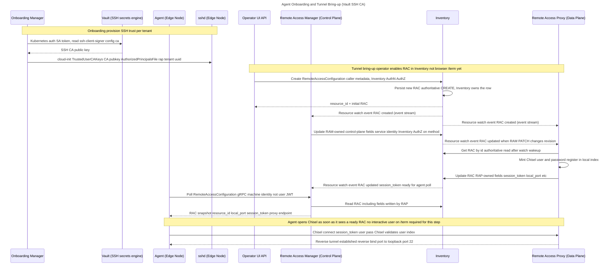
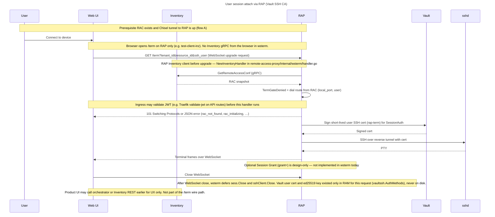

# Design Proposal: Reverse Proxy to Edge Nodes

Author(s): [Frątczak Wiktor]

Last updated: [03.07.2025]

## Abstract

Running edge workloads from a central orchestrator is only credible if operators can **get a shell** when logs,
metrics, or the network are not enough to explain a failure. In real deployments, nodes live in factories, retail,
telecom huts, and similar sites where **inbound administration ports are not allowed**, **NAT** hides the device, and
**truck rolls** are slow and expensive. Without a platform answer, teams fall back on **per-site VPNs**, **ad hoc port
forwarding**, or **exposing SSH on the internet**—patterns that **do not scale** across many tenants and that sit
**outside** *Inventory* authorization, audit, and lifecycle.

This proposal is that platform answer: **orchestrator-native remote access** built from an **outbound reverse tunnel**
(Chisel) from a **Remote Access Agent** to a **Remote Access Proxy**, interactive **`/term`** for the browser,
**short-lived Vault-signed SSH user certificates** for the RAP→`sshd` hop, and **`RemoteAccessConfiguration`** in
*Inventory* as the system of record for **who may enable access**, **which device**, and **which tenant**. The point
is **on-demand diagnostics and maintenance without publishing edge SSH to the public internet**, with multitenancy and
controls aligned to the rest of Intel Open Edge.

The next section is **`## Proposal`** (all design material), closed by **Rationale**, **Affected components and Teams**,
**Implementation plan**, and **Open issues** per the [design proposal template](./design-proposal-template.md). Suggested
reading order inside **Proposal**: summary → requirements → component changes → minimal database changes → diagram → technical background →
operational flows → security (§§1–4) → scalability.

## Proposal

### Summary

Each **edge node** runs a small **agent** that talks to the orchestrator; when remote access is enabled for that node,
the agent keeps an **outbound tunnel** open to a **cluster-side gateway** so administrators can reach **`sshd`** without
inbound ports on the customer network. The gateway also accepts a **browser WebSocket** for interactive shells. A
separate **orchestrator control-plane service** reconciles lifecycle and state against the same **remote-access resource**
that operators mutate through *Inventory* APIs. *Inventory* already defines that resource type in
`infra-core/inventory/api/remoteaccess/v1/remoteaccess.proto`; this proposal **extends** it and connects it end-to-end
(agent, gateway, tunnel fields, session semantics).

**Authorization** for creating or changing the remote-access resource stays on the existing *Inventory* pattern (caller
identity in metadata and **role-based access control** on API operations). This proposal does not add a parallel
identity stack inside *Inventory* itself. **At the gateway**, the **target** shape is familiar for edge surfaces:
**orchestrator-issued identity** for the **agent** and a **browser identity** carried as **JWT** where the ingress validates
it (e.g. Traefik `validate-jwt` on some routes — see chart), not inside **`wsterm`** today. Tenant claims must still match
the **resource row** and tunnel secret (no cross-tenant use from a leaked URL
or tunnel password alone). The **reference codebase** already uses Bearer metadata on the **agent ↔ control-plane**
path; extending **agent identity** to the **tunnel ingress** and tightening **tenant binding** in the gateway is the main
gap — *Security* (§§1–4 below) separates **target** from **(implementation)**.

**Shorthands introduced in this proposal** (standard terms like JWT or RBAC are not glossed here):

| Shorthand | Refers to |
| --- | --- |
| **RAP** | Remote Access Proxy — data-plane gateway (tunnel server, browser terminal, Vault signing toward **`sshd`**) |
| **RAM** | Remote Access Manager — control plane (agent API, RAC state reconciliation) |
| **RAC** | One **`RemoteAccessConfiguration`** row in *Inventory* |

### Requirements

To support secure and scalable remote access to edge nodes, the solution must:

* Allow users to initiate secure on-demand SSH sessions without direct exposure of edge devices.
* Provide a lightweight agent on each node, capable of establishing and maintaining an on-demand connection with the
  orchestrator’s Remote Access Proxy. The agent is a new component installed during node onboarding as a
  systemd-managed service; no extra installation step is required at session time.
* Provision tenant-scoped SSH trust on the edge node **at onboarding time**, before any remote-access
  session is ever requested: the Vault SSH CA public key must be installed as `TrustedUserCAKeys` in
  `sshd`, and `AuthorizedPrincipalsFile` must accept the tenant principal `rap:<tenant_uuid>`. This
  removes the need for long-lived SSH key distribution to nodes.
* Introduce a dedicated Vault **SSH secrets engine** mount that acts as the single CA trusted by
  edge-node `sshd`, with a signing role that scopes principals to `rap:<tenant_uuid>` and enforces
  short certificate TTLs.
* Enable the orchestrator to control the full session lifecycle (creation, updates, timeout, teardown).
* **Extend** the existing Inventory `RemoteAccessConfiguration` model (`remoteaccess.proto`) so session requests
  map cleanly to registered devices and states remain authoritative in *Inventory*.
* Expose a new orchestrator API for initiating and terminating interactive sessions, reachable from the
  UI (browser WebSocket) and from operator tooling.
* Enforce validation and access control to guarantee secure operations across diverse deployment environments.

### Proposed changes

Summary of what this proposal adds or extends. **Legend:** **(new)** = component or mount **introduced by this
proposal** (edge **Remote Access Agent**, orchestrator **RAM** and **RAP**, Vault SSH engine mount, …). **(extended)** =
**pre-existing** platform surfaces that gain behavior here (**Onboarding Manager**, *Inventory* `RemoteAccessConfiguration`,
…). **RAC column ownership** (who may
PATCH what) is in *Minimal database changes* → **RAC field ownership**. **Multi-tenant RAP** (JWT tenant vs RAC /
`session_token`, ingress JWT vs query vs RAC on **`/term`**) is specified in **Security** §§2–3 — not repeated in full
here. **OpenID Connect** is not implemented inside **`wsterm`**; the doc uses **JWT at ingress** (e.g. Traefik) where the
deployment attaches validation.

---

#### Remote Access Agent (**new**)

- **systemd** service on each edge node after onboarding.
- Polls **RAM**; opens **Chisel** to **RAP** for the session lifetime.
- **Design:** orchestrator **JWT** at RAP ingress **+** per-RAC **`session_token`** on Chisel; **tenant in JWT must
  match** tenant of the RAC for that tunnel (shared RAP) — see **Security §2**.
- **Code today:** Chisel **`session_token` only**; JWT file used for **RAM** gRPC. Vault SSH certs are for **RAP→sshd**
  on **`/term`**, not for the Chisel control connection.

---

#### Remote Access Manager (**new**)

- Control plane for remote-access lifecycle.
- **Single writer** on the RAC row for **`current_state`** and **`configuration_status_indicator`**; **reads**
  RAP-owned binding fields (`session_token`, `local_port`, …), does **not** PATCH binding mask.
- *Inventory* creates the RAC and enforces policy; **RAP** terminates **Chisel** and **`/term`**.

---

#### Remote Access Proxy (**new**)

- Data plane: agent **Chisel**, browser **`/term`**, ephemeral SSH toward edge **`sshd`**.
- **Single writer** for **binding** (`local_port`, `proxy_host`, `user`, `session_token`) and for proxy **operational**
  text (`configuration_status`, `configuration_status_timestamp`). Does **not** CREATE the RAC — *Inventory* does.
- **`/term`:** in-memory OpenSSH user cert via **Vault** (no private key on disk).

---

#### Vault usage (two narrow roles)

| Role | Component | Purpose |
| --- | --- | --- |
| **`remote-access-proxy`** | RAP | K8s auth to Vault; sign short-lived user certs (`rap-term`), `valid_principals=rap:<tenant_uuid>` |
| **`onboarding-manager`** | OM | K8s auth; **read only** `<mount>/config/ca` for SSH CA pubkey pushed in cloud-init |

Chart: `infra-charts/vault-ssh-secrets-engine`. OM uses SA **`orch-svc`** with a **separate** Vault policy from broad
`orch-svc` secret access; Helm: `env.rapVaultK8sAuthRole` → `VAULT_K8S_AUTH_ROLE` / `RAP_VAULT_K8S_AUTH_ROLE` on the OM
pod. Deep dive: *Vault SSH CA integration*.

---

#### Onboarding Manager (**extended**)

- Before any RAC: read Vault SSH CA from **`ssh-client-signer`** / **`config/ca`**; **cloud-init** installs **Agent**,
  **`TrustedUserCAKeys`**, **`AuthorizedPrincipalsFile`** for **`rap:<tenant_uuid>`**.
- Fresh **Vault** read each render (no CA cache in OM); ≈20–50 ms per node; simplifies CA rotation.
- Trust is **per tenant**, **per node** once; new RACs do not re-touch the node for SSH trust.

---

#### Vault SSH secrets engine (**new** platform mount)

- Default mount **`ssh-client-signer`**: single CA for edge **`sshd`**; signing role **`rap-term`**;
  `cert_type=user`, tenant-scoped principals. The **CA signing key** in Vault is **long-lived** (no automatic TTL on
  the key material); **user certificates** signed for `/term` use **short TTLs** on the role — see *Vault SSH CA integration*.

---

#### Inventory and orchestrator API (**extended**)

- Extend existing **`RemoteAccessConfiguration`** / `remoteaccess.proto` for tunnel metadata and state (see *Minimal
  database changes*).
- Operator/session APIs: RAC lifecycle **authorized at Inventory** (and gateways that forward identity). **`/term`**
  traffic to RAP; **JWT** at ingress where configured; **Session Grant** optional / not in `wsterm` yet.

---

RAM vs RAP split is intentional: scale **control plane** and **data plane** independently.

[//]: # (TODO: TBA When remote access config will be created how should Remote Access Manager know about this, should it ask inventory periodically - imo worse, or should the inventory itself notify manager about it)

### Minimal database changes

The **normative** schema is `RemoteAccessConfiguration` in
`infra-core/inventory/api/remoteaccess/v1/remoteaccess.proto` — it **predates** this reverse-proxy proposal and was
**extended in place** (new fields, stricter validation, or richer semantics as needed) rather than replacing the
resource kind. The block below is a **compact sketch** for readers who prefer pseudo-ER notation; field names and
enum values may drift slightly from the checked-in proto over time.

    RemoteAccessConfiguration {
      +string resource_id
      +InstanceResource instance
      +uint64 expiration_timestamp
      +uint32 local_port (optional)
      +string session_token (optional)            // <user>:<password> minted by RAP for Chisel auth
      +RemoteAccessState current_state (optional)
      +RemoteAccessState desired_state
      +string configuration_status (optional)
      +StatusIndication configuration_status_indicator (optional)
      +uint64 configuration_status_timestamp (optional)
      +string tenant_id
      +TIMESTAMP created_at
      +TIMESTAMP updated_at
    }

    RemoteAccessState {
      <<enum>>
      REMOTE_ACCESS_STATE_UNSPECIFIED = 0
      REMOTE_ACCESS_STATE_DELETED     = 1
      REMOTE_ACCESS_STATE_ERROR       = 2
      REMOTE_ACCESS_STATE_CONFIGURED  = 3
      REMOTE_ACCESS_STATE_STARTED     = 4
    }

#### RAC field ownership (single writer)

The orchestration path is **asynchronous and distributed**: *Inventory* publishes watch events, **RAM** and **RAP**
reconcile on independent loops, and the edge agent polls on its own cadence. Without explicit ownership, two
controllers updating the same `RemoteAccessConfiguration` row would **race** on overlapping fields. Following
common practice for loosely coupled reconcilers, the design assigns **exactly one orchestrator-side writer per
column group** and enforces it with **narrow Inventory field masks** (`UpdateRemoteAccessConfigBinding` vs
`UpdateRemoteAccessConfigState` in the remote-access managers’ code), so RAM and RAP never dual-write the same
columns.

| RAC fields (group) | Single writer | Role |
| --- | --- | --- |
| `local_port`, `proxy_host`, `user`, `session_token` | **RAP** | Data plane: reverse-tunnel endpoint, Chisel user, and `user:pass` material. Persisted in one **binding** mask so bootstrap can allocate port and token atomically. |
| `configuration_status`, `configuration_status_timestamp` (free-text operational narrative) | **RAP** | Proxy-side status lines (e.g. errors, “reconciled idle”); RAP’s Inventory mask **does not** include `configuration_status_indicator`. |
| `current_state`, `configuration_status_indicator` | **RAM** | Control plane: converge `current_state` toward `desired_state` when RAP-side readiness allows, flip **indicator**, mark **ERROR** when prerequisites fail. RAM **reads** `session_token` / binding fields but **does not** PATCH the binding mask. |
| `desired_state` | **Intent owner** (clients of the **Inventory API** with RAC update rights) | Declares what should happen (enable/disable/delete). **Inventory** exposes the API; **RAM** / **RAP** are the remote-access **resource managers** for their own column groups but **do not** PATCH `desired_state` in their masks — they **consume** it. |
| `resource_id`, `instance`, `tenant_id`, `expiration_timestamp`, `created_at`, `updated_at` | **Inventory create path** (plus hooks) | Identity and immutables established when the row is created; routine updates bump `updated_at` inside Inventory. |

If a future change needs a column to move between writers, the **field mask** and API contract must be updated
explicitly—**never** dual-write the same column from RAM and RAP.

#### Northbound reconcile: events, `reconcileAll`, and Inventory reads/writes

Both **RAM** and **RAP** use the same northbound pattern (`infra-managers/remote-access/.../handlers/northbound.go`
and `infra-managers/remote-access-proxy/.../handlers/northbound.go`):

* **Inventory `SubscribeEvents`** — each `SubscribeEventsResponse` carries `event_kind` and a `resource` field whose
  proto comment states that on **CREATED/UPDATED** it holds the **new row state** (`inventory.v1` API). In practice
  the handler still **only extracts `tenant_id` and `resource_id`** from the event and calls the same per-RAC
  controller entrypoint as periodic reconcile — it does **not** hand the embedded snapshot straight into the
  reconciler as the sole source of truth.
* **`reconcileAll` (ticker)** — calls **`FindRemoteAccessConfigs`** to **list every RAC id**, then invokes
  `reconcileResource` for each. That is a **backstop** if notifications were missed or ordering was odd; it is not
  the only path that touches Inventory.
* **Every `RAReconciler.Reconcile` / `RAPReconciler.Reconcile`** — begins with **`GetRemoteAccessConf`** (Inventory
  **Get** by id). So an event-driven reconcile **still performs an authoritative read** of the RAC today; the
  stream is a **wakeup + keys**, not a substitute for `Get` in current code.
* **Inventory PATCH** — happens **only when** the reconciler decides something must change (e.g. RAM converging
  `current_state` / indicator, RAP bootstrapping binding fields or operational `configuration_status`). If RAM sees
  spec ready and `desired_state` already equals `current_state`, it **acks without writing** after that read. RAP’s
  “skip” path avoids binding **writes** but may still refresh **local** Chisel/runtime from the freshly read row
  (e.g. after a proxy restart — see `ensureChiselRuntimeIfSkipped` in `rap_reconciler.go`).

So: **events do carry the resource in the wire protocol**, but **today’s managers still re-fetch** the row before
acting; **no extra Inventory write** occurs when there is nothing left to converge.

### High overview diagram

### Technical background

This section has **three layers** (read in order): **(1) reachability** — how the agent keeps an outbound tunnel open
(reverse-SSH pattern, implemented with Chisel over WebSockets); **(2) SSH authentication on the node** — how RAP proves
itself to `sshd` when a user opens `/term` (Vault user certificates; unrelated to Chisel’s `session_token`); **(3)
multitenancy** — how those pieces combine with Inventory and optional grants. **Sequence diagrams** at the end replay
the same story end-to-end. Read **before** *Required flow* if the vocabulary is new. Per-channel **trust and gaps** are
in **Security** §§1–4 (after the flow); **Minimal database changes** (earlier) defined RAC ownership.

#### Reachability: reverse tunnel (agent ↔ RAP)

**Chisel** answers only: “how does the orchestrator get a byte stream to `sshd` on a node that does not accept inbound
SSH?”. It does **not** replace SSH host/user authentication on that stream—that is the next major section.

##### Reverse SSH as a Secure Mechanism for Enabling Access Between Edge Devices via Orchestrator

In distributed edge environments, devices are often deployed behind NATs or firewalls, which makes direct inbound
connections from external networks impractical or even impossible. **Reverse SSH** provides a robust and secure
mechanism to establish such connectivity.  
In this approach, the **edge device initiates an outbound SSH connection** to a central component within the
orchestrator’s domain — the **Remote Access Proxy**. Since most networks allow outbound connections, this method
bypasses NAT traversal and eliminates the need for port forwarding or VPN tunnels.

Once the reverse SSH tunnel is established, the orchestrator can securely route client connections through the
Remote Access Proxy to the target edge device. This enables administrators or automated services to execute remote
commands, transfer files, or interact with device terminals without exposing the device’s SSH port directly to the
internet.

The reverse SSH mechanism also simplifies **session lifecycle management**: tunnels can be opened and closed on demand,
logged, and automatically cleaned up after a timeout or orchestration event. This approach aligns well with the **ephemeral, dynamic nature** of edge environments, where devices may frequently join or leave the network.

---

##### Chisel as a WebSocket Transport Layer for Reverse SSH

While traditional reverse SSH relies on TCP, modern edge environments often benefit from using
**WebSocket-based tunnels**, which can seamlessly traverse corporate proxies and restrictive firewalls.  
**Chisel** is an open-source, lightweight tunneling tool that supports exactly this functionality. In this project,
Chisel is not used as a standalone CLI tool but is **integrated as a Go library** within the `remote-access-proxy` and
`edge-node-agent` components, forming the **data plane** for all SSH reverse tunnels.

Chisel encapsulates SSH traffic inside a **WebSocket stream**, allowing the Remote Access Proxy to handle both SSH
and web-based client connections in a unified manner. This design enables advanced capabilities such as:

- **Bidirectional multiplexing** of multiple SSH sessions over a single WebSocket connection,
- **Secure session termination** and monitoring from the orchestrator layer,
- Integration with web interfaces (e.g., **xterm.js**) for browser-based SSH access,
- Efficient use of existing infrastructure — since WebSockets typically reuse port 443, no additional firewall rules are
  needed.

Using Chisel as a WebSocket transport layer provides a modern, cloud-native foundation for remote edge access — one that
remains compatible with HTTP-based load balancers, ingress controllers, and service meshes.

---

#### Authentication toward `sshd` on `/term` (RAP → edge, inside the tunnel)

After the tunnel exists, RAP connects to **`sshd` on the node** like any other SSH client. **Chisel credentials do not
authenticate that hop** — they only secured the tunnel setup. The subsections below cover **OpenSSH user
authentication** for that session: short-lived **Vault-signed user certificates** (and why static operator keys are
avoided).

##### Ephemeral Certificates vs SSH Keys

Traditional SSH authentication relies on **static key pairs** — long-lived public/private keys that must be distributed
and managed across devices. While simple to implement, static keys pose several operational and security challenges:

- Difficult key rotation and revocation,
- Risk of unauthorized reuse or leakage,
- Lack of auditability and time-bound access control.

To address these limitations, the platform uses **ephemeral SSH certificates** issued by **HashiCorp Vault**’s
**SSH secrets engine** acting as the trusted **Certificate Authority** for the orchestrator. Each time a `/term`
session is opened, the **Remote Access Proxy** generates a fresh in-memory key pair and asks Vault to sign a
**short-lived** OpenSSH **user certificate** (TTL 5 minutes, ceiling 15 minutes) bound to the tenant
principal. The certificate is used exactly once for the SSH handshake of that interactive session and is
discarded together with the in-memory key pair and the WebSocket. Because active SSH sessions are not
re-authenticated after the transport is established, the short TTL only needs to cover dial + handshake and
not the whole interactive session.

This approach provides several advantages:

- **Strong security guarantees** — certificates automatically expire, reducing the attack surface,
- **Centralized access control** — Vault policies define which orchestrator components may sign certificates and
  with which `valid_principals`, scopes, and TTLs,
- **Better traceability** — every access request is tied to a unique certificate identity (Vault serial + key id),
  simplifying auditing and compliance,
- **Seamless integration** with reverse SSH — ephemeral credentials are issued at session attach time, so no
  persistent SSH secret is stored on the edge node or pushed over the wire,
- **Tenant-scoped principal** — each cert carries a `valid_principals = rap:<tenant_uuid>` value that the edge
  node’s `sshd` matches against `AuthorizedPrincipalsFile`, providing cryptographic tenant isolation. Session-
  level context (user identity, role, RAC binding) is not encoded in the certificate; it lives in the Session
  Grant issued by the Remote Access Manager (see *Multitenancy and context-aware access control*).

###### Vault SSH CA integration

The platform uses Vault’s **SSH secrets engine** as the single source of trust for interactive SSH access to edge
nodes. The integration touches three components:

- **Onboarding Manager** — at edge-node provisioning time, reads the SSH CA public key from Vault
  (`<mount>/config/ca`, mount `ssh-client-signer`) using **Kubernetes auth**, and emits cloud-init that installs
  the key as `TrustedUserCAKeys` on the node’s `sshd` and configures `AuthorizedPrincipalsFile` to accept the
  tenant principal `rap:<tenant_uuid>`. Trust is established **per tenant**, before any
  `RemoteAccessConfiguration` exists, so reattaching new sessions does not require touching the node again.

    - **Vault role `onboarding-manager` (OM)** — provisioned by `infra-charts/vault-ssh-secrets-engine` alongside the
      RAP signing setup. Policy `onboarding-manager` grants **only `read` on `<mount>/config/ca`** — no other paths,
      no write/update. The role binds to Kubernetes ServiceAccount `orch-svc` in `orch-infra` (same SA as for
      broader secret access under Vault role `orch-svc` / policy `orch-svc`). Reusing one SA avoids a second
      ServiceAccount; isolation is at the **Vault policy** boundary (CA read is not merged into `orch-svc`). Vault
      Kubernetes auth allows the same SA to log in under different roles by name; OM uses `onboarding-manager` for
      this path (`env.rapVaultK8sAuthRole` → `VAULT_K8S_AUTH_ROLE` on the pod) and `orch-svc` for unrelated
      `secret/*` work. Co-locating policy + role
      in the chart that owns `ssh-client-signer` keeps engine, sign role, and CA-read role on one lifecycle.

    - **Cadence** — every cloud-init render does a fresh Kubernetes-auth login (`onboarding-manager`) and a
      `config/ca` read; OM does **not** cache the CA public key. The helper runs at most once per onboarded node
      (≈20-50 ms on a healthy cluster); CA rotation propagates to the next node without an OM pod restart. A
      short-TTL cache is optional if onboarding burst warrants it.

- **Remote Access Proxy** — for every `/term` request it generates an ephemeral ed25519 key pair in memory, calls
  `<mount>/sign/<role>` (default `rap-term`) with `valid_principals=rap:<tenant_uuid>`, `cert_type=user`, and an
  explicit `ttl=5m`, wraps the result in `ssh.AuthMethod`, and presents it to the edge `sshd` over the reverse
  tunnel. The private key never leaves the Proxy process and is dropped with the certificate when the WebSocket
  closes.

    - **Vault role `remote-access-proxy` (RAP)** — Kubernetes-auth role used only for this signing path: permitted
      to use `<mount>/sign/rap-term` (and related signing policy); distinct from `onboarding-manager`, which is
      read-only on `config/ca`. Both roles are defined in `vault-ssh-secrets-engine`.
- **Vault** — provides the `auth/kubernetes` method and the `ssh-client-signer` SSH secrets engine with a signing
  role whose policy permits the Proxy to sign certificates with the `rap:<tenant_uuid>` principal pattern.
  The signing role is configured with `ttl=5m` / `max_ttl=15m`, capping how long any issued certificate may
  live even if a client were to request a longer lifetime. The **Vault SSH CA key itself has no expiry** —
  it is generated once at engine bootstrap (`generate_signing_key=true`), persists in Vault storage, and is
  only rotated by an explicit platform operation (`vault delete <mount>/config/ca` followed by regeneration
  and re-rollout of any cached public key — see the Onboarding Manager bullet above for why OM does not
  cache it).

Principals follow the format **`rap:<tenant_uuid>`**. The RAC `resource_id` is intentionally **not** part of the
principal: the edge node can be made trust-ready during onboarding (when the tenant is known but a RAC may not
yet exist), while the `resource_id` from the `/term` request is still used by the Proxy to look up the active RAC
in Inventory and resolve the correct reverse-tunnel port.

#### Multitenancy and context-aware access control

In multi-tenant edge environments, where multiple organizations share the same orchestration platform, **tenant
isolation and contextual access control** are critical. The design splits these responsibilities across three
layers — none of them tries to encode everything in the SSH certificate alone:

- **SSH certificate (Vault SSH CA)** — carries a **single, tenant-scoped principal**
  `rap:<tenant_uuid>`, plus standard cert fields (TTL, `cert_type=user`, key id / serial issued by Vault for
  audit). The cert deliberately does **not** carry `user_id`, role, RAC `resource_id`, or session policy: it is
  consumed by `sshd` on the edge node, which only knows about `TrustedUserCAKeys` and
  `AuthorizedPrincipalsFile`, and would silently ignore richer claims anyway. Tenant separation is enforced
  here because a Vault-signed cert with principal `rap:<tenant-A>` will never satisfy
  `AuthorizedPrincipalsFile` on a node provisioned for `tenant-B`.
- **Session Grant (optional, RAP-facing store)** — **target**: short-lived UUID binding
  **`(tenant_id, resource_id, ssh_user, user_id, exp, one_time=true)`** after **Inventory** has accepted intent.
  **(implementation)** `wsterm` has no `grant=` handler yet. **RAM** is not the interactive SSO validation point for
  **`/term`**.
- **Tunnel credential (RAP)** — the per-RAC Chisel `session_token` minted by the Proxy is itself
  tenant/RAC-scoped (it can authenticate **only** the agent for that specific RAC), giving an additional
  data-plane separation independent of any user-facing claims. **Target:** it is still paired with **JWT tenant ==
  RAC tenant** at RAP (§Security 2) so tunnel secrets never substitute for tenancy proof on a shared proxy.

The orchestrator acts as a **central trust authority** in the sense that **Inventory** is the system of record
for RAC authorization; **RAP** terminates **Chisel** (tunnel credential + **target** agent JWT at ingress) and
**`/term`** (ingress **JWT** where configured + Inventory gate in RAP); and the Vault CA is the only SSH signer edge `sshd` trusts
for interactive access. **Enforcement is layered**: **Inventory RBAC**, **machine JWT to RAM**, **agent JWT + Chisel
`session_token` toward RAP**, **ingress JWT + optional grant toward `/term`**, **Vault signing** on the RAP→`sshd` leg, and
**certificate verification** on the node.

This design aligns with the **zero-trust security model**: trust is not implicitly granted based on network
location but dynamically derived from **Inventory-backed policy** on resource changes, **layered credentials** at
the edges of the data plane, tenant context (`rap:<tenant_uuid>` principal), and **short-lived Vault user certs** —
without relying on long-lived shared SSH keys on clients.

#### Sequence diagrams

```mermaid
sequenceDiagram
    title Agent Onboarding and Tunnel Bring-up (Vault SSH CA)

    participant OM as Onboarding Manager
    participant VAULT as Vault (SSH secrets engine)
    participant AG as Agent (Edge Node)
    participant SSHD as sshd (Edge Node)
    participant OP as Operator UI API
    participant RAM as Remote Access Manager (Control Plane)
    participant INV as Inventory
    participant RAP as Remote Access Proxy (Data Plane)

    note over OM,SSHD: Onboarding provision SSH trust per tenant
    OM->>VAULT: Kubernetes auth SA token, read ssh-client-signer config ca
    VAULT-->>OM: SSH CA public key
    OM->>SSHD: cloud-init TrustedUserCAKeys CA pubkey AuthorizedPrincipalsFile rap tenant uuid

    note over OP,RAP: Tunnel bring-up operator enables RAC in Inventory not browser /term yet
    OP->>INV: Create RemoteAccessConfiguration caller metadata, Inventory AuthN AuthZ
    INV->>INV: Persist new RAC authoritative CREATE, Inventory owns the row
    INV-->>OP: resource_id + initial RAC
    INV-->>RAM: Resource watch event RAC created (event stream)
    INV-->>RAP: Resource watch event RAC created (event stream)
    RAM->>INV: Update RAM-owned control-plane fields service identity Inventory AuthZ on method
    INV-->>RAP: Resource watch event RAC updated when RAM PATCH changes revision
    RAP->>INV: Get RAC by id authoritative read after watch wakeup
    RAP->>RAP: Mint Chisel user and password register in local index
    RAP->>INV: Update RAC RAP-owned fields session_token local_port etc
    INV-->>RAM: Resource watch event RAC updated session_token ready for agent poll
    AG->>RAM: Poll RemoteAccessConfiguration gRPC machine identity not user JWT
    RAM->>INV: Read RAC including fields written by RAP
    RAM-->>AG: RAC snapshot resource_id local_port session_token proxy endpoint
    note over AG,RAP: Agent opens Chisel as soon as it sees a ready RAC no interactive user on /term required for this step
    AG->>RAP: Chisel connect session_token user pass Chisel validates user index
    RAP-->>AG: Reverse tunnel established reverse bind port to loopback port 22
```

```mermaid
sequenceDiagram
    title User session attach via RAP (Vault SSH CA)

    participant U as User
    participant UI as Web UI
    participant INV as Inventory
    participant RAP as RAP
    participant VAULT as Vault
    participant SSHD as sshd

    note over U,RAP: Prerequisite RAC exists and Chisel tunnel to RAP is up (flow A)

    U->>UI: Connect to device
    note over UI,RAP: Browser opens /term on RAP only (e.g. test-client-inz). No Inventory gRPC from the browser in wsterm.
    UI->>RAP: GET /term?tenant_id&resource_id&ssh_user (WebSocket upgrade request)

    note over RAP,INV: RAP Inventory client before upgrade — NewInventoryHandler in remote-access-proxy/internal/wsterm/handler.go
    RAP->>INV: GetRemoteAccessConf (gRPC)
    INV-->>RAP: RAC snapshot
    RAP->>RAP: TermGateDenied + dial route from RAC (local_port, user)

    note over RAP,UI: Ingress may validate JWT (e.g. Traefik validate-jwt on API routes) before this handler runs
    RAP-->>UI: 101 Switching Protocols or JSON error (rac_not_found, rac_initializing, …)

    RAP->>VAULT: Sign short-lived user SSH cert (rap-term) for SessionAuth
    VAULT-->>RAP: Signed cert

    RAP->>SSHD: SSH over reverse tunnel with cert
    SSHD-->>RAP: PTY
    RAP-->>UI: Terminal frames over WebSocket

    note over RAP: Optional Session Grant (grant=) is design-only — not implemented in wsterm today

    UI->>RAP: Close WebSocket

    note over RAP: After WebSocket close, wsterm defers sess.Close and sshClient.Close. Vault user cert and ed25519 key existed only in RAM for this request (vaultssh.AuthMethods), never on disk.

    note over UI,INV: Product UI may call orchestrator or Inventory REST earlier for UX only. Not part of the /term wire path.
```

### Required flow

Three phases below: **onboarding + trust**, **persistent tunnel**, **ephemeral terminal**. Intel Open Edge and EIM
docs often split the edge lifecycle into **Day 0** (onboarding, first-boot provisioning, trust to the orchestrator)
and **Day 1** (managed runtime: agents, telemetry, operational APIs — including *reachability* for remote access).
**Day 2** in that vocabulary is mainly upgrades and day-2 operations; it is **not** where interactive **`/term`**
belongs — Phase B is simply **on-demand** use of the tunnel established in Day 1. See *EIM modular decomposition*
(`edge-manageability-framework/design-proposals/eim-modular-decomposition.md`: Day 0 / Day 1 / Day 2).

| Phase | Intel lifecycle (this doc) | What happens |
| --- | --- | --- |
| **0** | **Day 0** (+ first Day-1 hook) | Vault SSH CA via OM, **cloud-init**, **Agent** + `sshd` trust; then Agent **polls RAM** (managed edge starts). |
| **A** | **Day 1** (remote-access data plane) | **RAC** in Inventory, **Chisel** to **RAP**, tunnel ready. |
| **B** | **On-demand** (not a separate “day”) | Browser **`/term`** over the existing tunnel. |

---

#### 0. Edge-node onboarding (**Day 0**; once per node, before any RAC exists)

1. The Onboarding Manager authenticates to Vault via Kubernetes auth using its existing
   ServiceAccount `orch-svc` against the dedicated role `onboarding-manager`, and reads the SSH CA
   public key from the Vault SSH secrets engine (`<mount>/config/ca`, default mount
   `ssh-client-signer`).
2. The Onboarding Manager emits cloud-init that, on first boot of the edge node:
    * installs the **Remote Access Agent** binary and its systemd service unit,
    * writes the Vault SSH CA public key to `/etc/ssh/trusted-user-ca-keys.pem` and sets
      `TrustedUserCAKeys` in `sshd_config`,
    * configures `AuthorizedPrincipalsFile` for the node’s service user to accept the tenant
      principal `rap:<tenant_uuid>`, and restarts `sshd`.
3. **Day 1 (start):** once the node has finished first-boot provisioning, the **Agent** polls **RAM** over **gRPC**
   with **machine identity** (Bearer metadata; not interactive SSO). The **reverse tunnel to RAP** still waits for a
   **RAC** (Phase A): it uses **Chisel** + per-RAC **`session_token`**; **target** adds **agent JWT** at RAP ingress
   (§Security 2). **SSH trust** from steps 1–2 is already on the node, so creating a **RAC** later does not require
   another onboarding pass.

---

#### A. Tunnel bring-up (**Day 1** remote-access; Agent ↔ Remote Access Proxy)

1. An operator (UI/API) requests remote access enablement for a specific edge node through the **Inventory API**
   (directly or via an orchestrator REST gateway that forwards caller identity into Inventory gRPC metadata).
   **Inventory performs AuthN + AuthZ** (JWT validation where applicable, plus RBAC on `Create`/`Update` for the
   RAC resource) **before** the row is persisted.
2. The **Inventory** service performs the authoritative **CREATE** of the `RemoteAccessConfiguration` (RAC) row
   (identifiers, tenant binding, instance linkage, timestamps, etc.).
3. The **intent owner** — any **authorized caller of the Inventory API** (operator UI, automation, or another
   orchestrator service with RAC **update** RBAC) — sets **`desired_state`**. **Inventory** is the **API and store**;
   it is **not** a “resource manager” in the same sense as **RAM** / **RAP**, which reconcile RAC rows but **do not**
   write `desired_state` through their binding/state masks. **RAM** is the **single writer** for
   **`current_state`** and **`configuration_status_indicator`** once it reconciles readiness; see **RAC field
   ownership** under *Minimal database changes*.
4. The **Remote Access Proxy** reconciles the RAC (watch/list from Inventory), mints the per-RAC Chisel
   `session_token` (`<user>:<password>`) into its in-process Chisel user index, and **writes the data-plane fields
   it owns** (for example `session_token` and local port assignment) **back into the RAC in Inventory**.
5. The Remote Access Agent polls the Manager and receives the RAC (including the
   `session_token` that the Proxy just wrote into Inventory).
6. The Agent opens the Chisel reverse tunnel (`R:local_port → loopback:22`) to the Remote Access Proxy with the
   per-RAC **`session_token`** as **Chisel `Auth`**. **(implementation)** ingress JWT for the agent is not wired on the
   Chisel route yet; **target** in §Security 2.
7. **RAP** may refresh **proxy operational** text (`configuration_status` / timestamp) on the RAC. **RAM** then
   advances **`current_state`** (and indicator if used) toward **`desired_state`** when its reconciler considers
   the tunnel ready — RAP does **not** own `current_state` (single-writer table).

[//]: # (   Should RAP do it by itself or via Remote Access Manager )

---

#### B. Interactive session attach (**on-demand**; User ↔ Remote Access Proxy)

8. The user authenticates out-of-band to the platform identity layer (deployment-specific). **Creating or changing the RAC** (Phase A) already
   went through **Inventory** AuthN/AuthZ; **`wsterm` does not require a separate browser call to Inventory** immediately
   before `/term`. A full product UI may still call an orchestrator or Inventory-backed REST API for **UX** (lists,
   buttons, “enable remote access”)—that is independent of the terminal wire path.
9. The browser opens **`/term` on RAP** only—`wss://…/term?tenant_id=…&resource_id=…&ssh_user=…` (see
   `test-client-inz`). **RAP** loads the RAC with **`GetRemoteAccessConf`** **before** the WebSocket upgrade, runs
   **`TermGateDenied`**, then upgrades and dials `sshd` with **Vault** user certs (`NewInventoryHandler` in
   `infra-managers/remote-access-proxy/internal/wsterm/handler.go`). **Target:** **JWT** validated at **ingress** where
   the route uses middleware (e.g. Traefik **`validate-jwt`** — not implemented inside **`wsterm`**). Optional **Session Grant** is **target** only until implemented in `wsterm`. Terminal traffic
   stays inside the WebSocket.

### Security considerations

How users and edge machines are authenticated before a tunnel or **`/term`** session exists.

**Reading this section.** Bullet lists under **Design** state the intended product behavior. **As implemented today**
summarizes the current repository only. That split avoids mixing “should” and “is” in one paragraph.

---

#### 1. Agent ↔ Remote Access Manager

- **gRPC** over **TLS**; **Bearer** in metadata; **`GetRemoteAccessConfigByGuid`** carries the host GUID so Inventory resolves the RAC in-tenant.
- **Code:** `edge-node-agents/remote-access-agent`, `infra-managers/remote-access/.../grpc_server.go`.
- RAC **create/update** stays **Inventory RBAC**; RAM only reads binding fields written by RAP and returns snapshots to the agent.

---

#### 2. Agent ↔ Remote Access Proxy (Chisel)

**Design**

- Agent opens **Chisel** to RAP (WebSocket transport inside the library; URL from RAC / config).
- **Two factors at RAP:** (1) **Orchestrator agent JWT** validated at ingress (or in RAP) — *who* is connecting. (2) **`session_token`** (`user:pass`) as Chisel `Auth` — *which RAC tunnel*; minted by RAP, stored in Inventory, returned via RAM.
- **Tenant binding:** claim in the agent JWT (e.g. `tenant_id` / `tid`, per platform standard) **must equal** the tenant of the RAC tied to this `session_token` (Inventory is source of truth). Stops cross-tenant use on a **shared RAP** even if **`session_token`** or **proxy_host** is wrong or stolen.

**As implemented today**

- Chisel client sends **`session_token` only** (`remote-access-agent/internal/proxy/proxy.go`). JWT file is for **RAM**, not Chisel.
- Helm **Chisel** IngressRoute has **no** `validate-jwt`; HTTP API route does (`infra-charts/remote-access-proxy/templates/service.yaml`).
- **Gap:** ingress and/or RAP Chisel path must gain JWT + tenant-vs-RAC check to match **Design**.

**`/term` traffic (different leg)**

- Operator browser **`/term`**: RAP dials edge **`sshd`** through the tunnel with **Vault** ephemeral user certs (`vaultssh`, `wsterm`). Node trusts Vault CA + `rap:<tenant_uuid>`. Agent does not hold those signing keys.

---

#### 3. User ↔ Remote Access Proxy (`/term`)

**Design**

- Browser **`/term`** with **`tenant_id`**, **`resource_id`**, **`ssh_user`**; **JWT** at ingress where wired (not in **`wsterm`**); RAP checks RAC via **Inventory**; optional **Session Grant** when product adds it.
- **Tenant binding:** ingress **JWT** tenant claim **=** query **`tenant_id`** **=** **`tenant_id` on the RAC** for **`resource_id`**. Reject if any mismatch.

**As implemented today**

- **Traefik** `validate-jwt` on RAP API host is common; **`wsterm`** does Inventory + **`TermGateDenied`**, does not parse **`Authorization`** in Go yet — full triple check needs claims in-process or a trusted tenant header from ingress.
- **Session Grant** (`grant=`) not in `wsterm`. Vault user certs minted in RAP per session; no long-lived user SSH key in browser.

---

#### 4. User / operator ↔ Inventory (and REST gateway)

- RAC lifecycle: **Inventory** (or pass-through APIs with same metadata).
- **AuthN/AuthZ:** existing platform JWT + **RBAC per method** — authoritative for “may this caller change **this** RAC in **this** tenant?”; not duplicated inside RAM as a second policy engine.

### Scalability considerations

Scalability is a critical aspect of enabling secure remote access in large-scale edge deployments.  
In environments where thousands of edge devices maintain reverse SSH tunnels, the system must efficiently manage
connections, sessions, and certificate lifecycles without becoming a bottleneck.

Several architectural mechanisms contribute to scalability:

- **Connection multiplexing** — multiple SSH sessions can share a single WebSocket connection through Chisel’s built-in
  multiplexing layer, significantly reducing the number of open sockets, TLS handshakes, and context switches per
  device.
  This allows the orchestrator to maintain connectivity with a large number of edge nodes using minimal system
  resources.

- **Ephemeral session model** — user-facing **`/term`** sessions are short-lived: **JWT** at ingress when enabled, then
  **RAP** uses **Vault** SSH auth toward the edge and drops ephemeral key material when the WebSocket closes.
  **(implementation)** Optional **Session Grant** is not in `wsterm` yet.

- **Differentiated credential lifetimes** — two channels:
    - **Edge-node ↔ Remote Access Proxy** — **target**: **agent JWT** at ingress plus **Chisel `session_token`**
      (`user:pass`) minted by **RAP**, stored in Inventory, returned via **RAM**. **(implementation)** the agent
      currently supplies **only** `session_token` as Chisel `Auth`; extending the client to attach the same JWT used
      for RAM (or a dedicated RAP token) and enabling `validate-jwt` on the Chisel route completes the model.
    - **Remote Access Proxy ↔ Edge Node `sshd`** (inside the tunnel) uses **short-lived Vault-signed SSH user
      certificates**, minted on every `/term` request with a 5-minute TTL (15-minute ceiling enforced by the
      Vault role) and the principal `rap:<tenant_uuid>`. They are consumed exactly once for the SSH handshake
      and discarded together with the WebSocket session, providing time-bound,

      auditable, just-in-time access without long-lived secrets on either side.

- **Stateless orchestration layer** — session metadata, certificate mappings, and tunnel state are persisted in a
  distributed data store (e.g., etcd or PostgreSQL). This allows horizontal scaling of multiple `remote-access-proxy`
  replicas
  without maintaining shared in-memory state, enabling reliable load balancing and failover.

- **Load-aware routing** — the orchestrator can distribute tunnel creation and connection requests across multiple
  `remote-access-proxy` instances based on CPU load, memory usage, or active connection count. This avoids bottlenecks
  and
  supports linear scalability with the number of deployed proxies.

- **Tenant-based segmentation** — tenant isolation is enforced cryptographically and per resource, not by static
  port partitioning: each Vault-signed SSH cert carries `rap:<tenant_uuid>` as its principal; **`/term`** binds via
  query **`tenant_id` / `resource_id`** (plus Inventory read), **Chisel** binds via per-RAC **`session_token`** and
  reverse port, optional Session Grants remain design-only, and **Inventory RBAC** governs who may create or change RAC
  rows. The same Remote Access Proxy instance can
  therefore serve many tenants on a single ingress port without weakening isolation, while observability is sliced
  by `tenant_id` / `resource_id` fields present in every log event and metric label.

- **Graceful degradation** — when system capacity approaches defined thresholds, new session requests can be queued,
  rate-limited, or temporarily rejected with appropriate feedback to the user or orchestrator. This ensures that the
  system degrades predictably under heavy load rather than failing abruptly.

This design balances **security, stability, and scalability**. Persistent tunnels between edge nodes and proxies ensure
continuous reachability, while ephemeral user sessions provide secure, auditable, and resource-efficient access to those
connections through the orchestration layer.

#### Multiplexing: one port, many sessions

Chisel multiplexes many logical SSH sessions over a single WebSocket to the proxy, which keeps connection counts and TLS overhead manageable when thousands of edges hold long-lived tunnels.

## Rationale

**Reverse outbound tunnel (Chisel / reverse SSH pattern)** avoids inbound firewall rules and NAT pinholes on the edge site; the agent dials the orchestrator, which matches how enterprise networks are already operated.

**Vault SSH user certificates for `/term`** replace long-lived operator SSH keys on workstations: short TTL, tenant-scoped `rap:<tenant_uuid>` principal, and a single CA trusted by `sshd` (`TrustedUserCAKeys`) installed at onboarding.

**Split RAM / RAP** separates control-plane reconciliation (Inventory state, agent API) from data-plane termination (Chisel, `/term`, Vault signing) so each tier can scale and fail independently.

Alternatives considered: site-to-site VPN (heavy operational cost), exposing edge SSH directly (unacceptable attack surface), static per-device SSH keys (rotation and revocation pain). The chosen stack trades more moving parts (Vault mount, two managers, agent) for **just-in-time** credentials and **Inventory** as the authorization system of record.

## Affected components and Teams

- **Onboarding Manager** — Vault CA read, cloud-init for Agent + `sshd` trust.
- **Inventory** — `RemoteAccessConfiguration` API and persistence (existing resource extended).
- **Remote Access Manager** — gRPC to agents; RAC state / indicator writer.
- **Remote Access Proxy** — Chisel server, `/term`, Vault signing, Inventory binding writer.
- **Remote Access Agent** — poll RAM, Chisel client, systemd packaging.
- **Platform charts** — `vault-ssh-secrets-engine`, `remote-access-proxy` (Traefik / JWT routes), related policies.
- **Teams** — edge agent, orchestrator services, platform security / identity, SRE for Vault and ingress.

## Implementation plan

Phased delivery aligns with **Required flow** (above): (1) **Day 0** — Vault SSH engine + OM cloud-init + Agent install; (2) **Day 1** — RAC lifecycle, RAP binding fields, Chisel tunnel bring-up, RAM state convergence; (3) **On-demand** — `/term` hardening (ingress **JWT**, Inventory gate, optional Session Grant), **agent JWT + tenant binding** on the Chisel ingress to close the gap called out in Security §2. Sequencing vs product milestones and quarterly releases is owned by the program manager; this doc does not lock dates.

## Open issues (if applicable)

- **Session Grant** — one-time `(tenant_id, resource_id, …)` binding for `/term` is design-only until implemented in `wsterm`.
- **Chisel path** — `validate-jwt` and in-RAP tenant-vs-RAC check for agent connections (Security §2 **Gap**).
- **`/term` claim alignment** — triple match (ingress **JWT** tenant claim, query `tenant_id`, RAC row) may require forwarding normalized claims from Traefik or parsing `Authorization` in RAP.
- **Multi-proxy routing** — load-aware assignment of RACs to RAP replicas (mentioned under scalability) may need explicit routing keys beyond today’s deployment assumptions.
- **Rotation of CA keys** — Currently we assume that we do never roratate the existing CA key pair, since the risk of losing a private key is low, however once it's get stolen we should be able to rotate all the keys on Edge Nodes gracefully.
